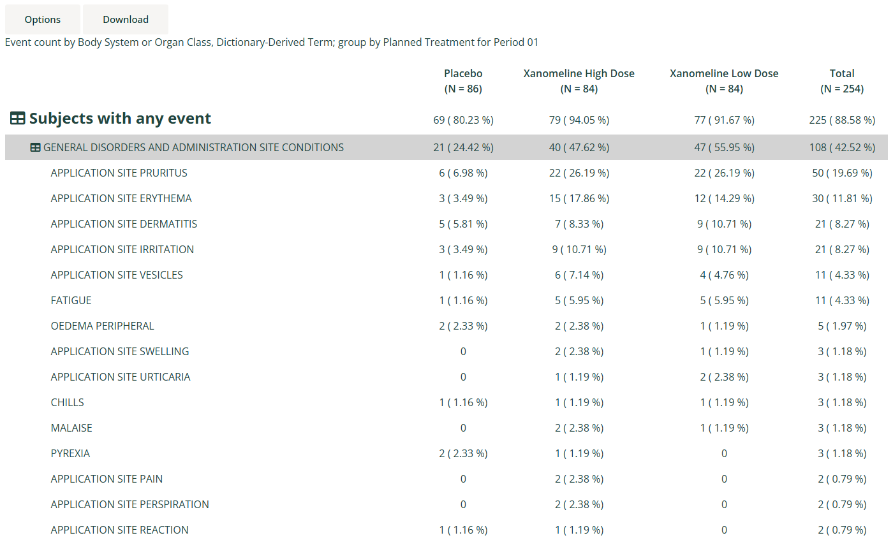
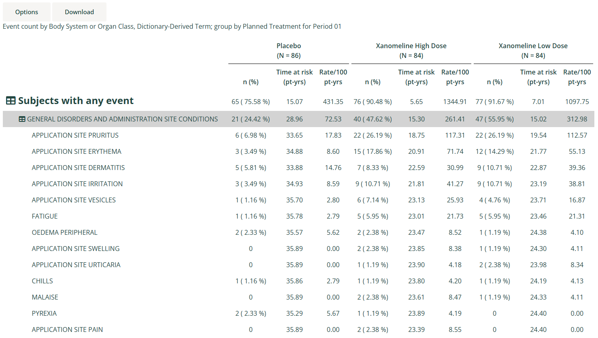

```{r, include = FALSE}
knitr::opts_chunk$set(
  collapse = TRUE,
  comment = "#>"
)
```





This guide provides a detailed overview of the `hierarchical_count_table` module and its features. It is meant to
provide guidance to App Creators on creating Apps in DaVinci using the `hierarchical_count_table` module. Walk-throughs
for sample app creation using the module are also included to demonstrate the various module specific features.

The `hierarchical_count_table` module makes it possible to visualize a hierarchy table with event counts for each of the
levels, with the option of showing time at risk and incidence rates.

# Features

- One or two levels of hierarchy, and a top-level summary of subjects with any event.
- Second level of hierarchy can be collapsed to only show the first level.
- First level of hierarchy can be collapsed to only show the subjects with any event.
- Grouping with group population size (N) displayed across columns of the table, with an optional "Total" column.
- Event counts and percentages are displayed, and optionally time at risk and incidence rates can be displayed.
- Events within the hierarchy ordered by descending event count (totalled across all groups).
- Tables can be downloaded as Excel (.xlsx) or Word (.rtf).
- It supports bookmarking.

# Arguments for the module

`dv.tables::mod_hierarchical_count_table()` module uses several arguments with the following being mandatory and
the rest optional. As part of app creation, the app creator should specify the values for these arguments as applicable.

**Mandatory Arguments**

-   `module_id` : A unique identifier of type character for the module
    in the app.

-   `subjid_var`: A common column across all datasets that uniquely identify subjects. By default: "SUBJID"

-   `table_dataset_name`: The dataset that contains the events per row. For example, `ADAE`

-   `pop_dataset_name`: The dataset that contains one row per subject in the total population. For example, `ADSL`
    It expects a one-record-per-subject dataset at least containing `subjid_var`, with a structure similar to
    https://www.cdisc.org/kb/examples/adam-subject-level-analysis-adsl-dataset-80283806
    
Refer to `dv.tables::mod_hierarchical_count_table()` for the complete list of arguments and their description.

# Input menus
  
A drop-down "Options" menu provides the following inputs:

- **Event count by**: Selection of one or two levels of hierarchy variables from the table (events) dataset, to be
  displayed down the left side of the table, e.g. `AEBODSYS`, `AEDECOD`.
- **Group by**: Selection of a grouping variable from the subject-level population dataset, to be displayed across the
  top of the table, e.g. `TRT01P`.
- **Minimum %**: The minimum percentage threshold for filtering events. Rows where the percentage of subjects (totalled
  across all group categories) is below this threshold will be removed from the output. Defaults to `0`.
- **Total**: Checkbox that controls whether or not to display a "Total" column totalling data from all group categories.

The following inputs will also be available in the "Options" menu when the `show_time_at_risk_options` module argument
is set to `TRUE`:

- **Event Date**: An ISO 8601 formatted character date (e.g. `AESTDTC`) or "Date" class (e.g. `ASTDT`) from the table
  events dataset. Events with missing or partial dates will be excluded from the analysis.
- **Origin Date**: An ISO 8601 formatted character date (e.g. `RFXSTDTC`) or "Date" class (e.g. `TRTSDT`) from the
  subject-level population dataset. Events occurring before origin date will be excluded from the analysis.
- **Censor Date**: An ISO 8601 formatted character date (e.g. `RFXENDTC`) or "Date" class (e.g. `TRTEDT`) from the
  subject-level population dataset. Events occurring after censor date will be excluded from the analysis.
- **Time at Risk**: Checkbox that controls whether or not to display time at risk and incidence rate columns. If a
  subject has a missing or partial origin or censor date, time at risk cannot be calculated and the subject will be
  excluded from the population count. Note that even if the checkbox is unchecked, events will still be selected based
  on event, origin and censor dates, but population count will not be affected.

# Visualizations

## Hierarchy Event Count table

A collapsible hierarchy table that can optionally display time at risk and incidence rate.

# Creating a hierarchical count table application

The following code specifies the bare minimum module arguments with no default hierarchy or group specified:

```{r, eval=FALSE}
requireNamespace("pharmaverseadam")

dv.manager::run_app(
  data = list(dummy = list(adsl = pharmaverseadam::adsl,
                           adae = pharmaverseadam::adae)),
  module_list = list(
    "AE Hierarchy Table" = dv.tables::mod_hierarchical_count_table(
      module_id = "hierarchical_count_table",
      table_dataset_name = "adae",
      pop_dataset_name = "adsl"
    )
  ),
  filter_data = "adsl",
  filter_key = "USUBJID"
)
```

The following code specifies module arguments for the display of a body system and preferred term hierarchy and planned
treatment group, with date variables specified for time at risk and incidence rate analysis:

```{r, eval=FALSE}
requireNamespace("pharmaverseadam")

dv.manager::run_app(
  data = list(dummy = list(adsl = pharmaverseadam::adsl,
                           adae = pharmaverseadam::adae)),
  module_list = list(
    "AE Time at Risk Hierarchy Table" = dv.tables::mod_hierarchical_count_table(
      module_id = "hierarchical_count_table",
      table_dataset_name = "adae",
      pop_dataset_name = "adsl",
      show_time_at_risk_options = TRUE,
      show_modal_on_click = TRUE,
      default_hierarchy = c("AEBODSYS", "AEDECOD"),
      default_group = "TRT01P",
      default_event_date = "AESTDTC",
      default_origin_date = "RFSTDTC",
      default_censor_date = "RFENDTC",
      default_total = FALSE,
      default_risk = TRUE
    )
  ),
  filter_data = "adsl",
  filter_key = "USUBJID"
)
```

# Download

This module allows downloading the table as Excel (.xlsx) or Word (.rtf).

In the downloaded table, overall number of patients (`N =` seen in the selected group's column header) is shown in the first row below the column names.

Additionally, if the option to split count and percent into separate columns is selected, then selected group variable's metrics is split into two columns for every group item, `{group item} [N]` to show count value and `{group item} [%]` to show relative percentage.

# Drill down functionality

When a cell is clicked the set of subjects in the cell is shown. Each of the ids is clickable and it allows
exploring that participant in an additional module, for example `dv.papo`.
