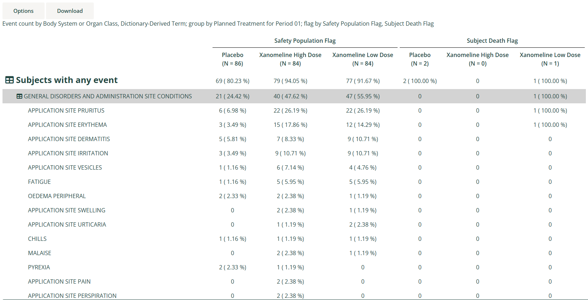

```{r, include = FALSE}
knitr::opts_chunk$set(
  collapse = TRUE,
  comment = "#>"
)
```

This guide provides a detailed overview of the `dv.tables::mod_hierarchical_count_table()` module and its features. It
is meant to provide guidance to App Creators on creating Apps in DaVinci using the module. Walk-throughs for sample app
creation using the module are also included to demonstrate the various module specific features.

The module makes it possible to visualize a hierarchy table with event counts for each of the levels, with the option of
showing time at risk and incidence rates.

# Features

- Up to four levels of hierarchy, and a top-level summary of subjects with any event.
- Hierarchy levels can be collapsed to only show higher levels. If the highest hierarchy level is collapsed then only
  the subjects with any event top-level summary is shown.
- Up to two levels of grouping by population dataset variables define the columns of the summary table, with group
  population size (N) displayed for each column. A special grouping level derived from one or more population flagging
  variables can also be used.
- An optional "Total" group can be derived and displayed for the last population grouping level.
- Optionally apply sub-grouping by a variable from the events data (e.g. event severity).
- Event counts and percentages are displayed, and optionally time at risk and incidence rates can be displayed.
- Events within the hierarchy ordered by descending event count (totalled across all groups).
- Tables can be downloaded as Excel (.xlsx) or Word (.rtf).
- It supports bookmarking.

# Arguments for the module

The `dv.tables::mod_hierarchical_count_table()` module uses several mandatory arguments with the rest of the arguments
defaulted or optional. As part of app creation, the app creator should specify the values for all mandatory arguments,
and values for any other arguments as applicable.

**Mandatory Arguments**

- `module_id` : A unique identifier of type character for the module in the app.
- `table_dataset_name`: The name of the dataset that contains the events per row, e.g., `"ADAE"`.
- `pop_dataset_name`: The name of the dataset that contains one row per subject in the total population, e.g., `"ADSL"`.
  It expects a one-record-per-subject dataset at least containing `subjid_var`, with a structure similar to
  https://www.cdisc.org/kb/examples/adam-subject-level-analysis-adsl-dataset-80283806

Please refer to `dv.tables::mod_hierarchical_count_table()` for the complete list of arguments and their description.

# Input menus

A drop-down "Options" menu provides the following inputs:

- **Event count by**: Selection of one to four levels of hierarchy variables from the table (events) dataset, to be
  displayed down the left side of the table, e.g. `AEBODSYS`, `AEDECOD`.
- **Group by**: Selection of a grouping variable from the subject-level population dataset, to be displayed across the
  top of the table, e.g. `TRT01P`.
- **Minimum %**: The minimum percentage threshold for filtering events. Each displayed group cell whose percentage of
  subjects is below this threshold has its event count and percentage replaced with a dash (—). Defaults to `0`.
- **Remove rows under minimum %**: Checkbox that controls whether to remove entire rows (across all hierarchy levels)
  for which every group's percentage of subjects falls below the **Minimum %** threshold, instead of just showing a
  dash for those cells.
- **Total**: Checkbox that controls whether or not to display a "Total" column totalling data from all group categories.

The following input will also be available in the "Options" menu when the `show_pop_flag_selection` module argument
is set to `TRUE`:

- **Population flags**: Selection of one or more flagging variables from the population dataset, to be displayed across
  the top of the table. The flags are subsetting on `"Y"` values.
- **Move after grouping variables**: Checkbox that controls whether the flags should be moved to after (below) the
  grouping variables. Otherwise, they will appear before (above) the grouping variables.
  
  The following input will also be available in the "Options" menu when the `show_event_group_by` module argument
is set to `TRUE`:

- **Event group by**: Selection of a sub-grouping variable from the table (events) dataset, to be displayed across the
  top of the table under the main grouping, e.g. `AESEV`.

The following inputs will also be available in the "Options" menu when the `show_time_at_risk_options` module argument
is set to `TRUE`:

- **Event Date**: A "Date" class (e.g. `ASTDT`) from the table events dataset. Events with missing dates will be
  excluded from the analysis.
- **Origin Date**: A "Date" class (e.g. `RANDDT`) from the subject-level population dataset. Events occurring before
  origin date will be excluded from the analysis.
- **Censor Date**: A "Date" class (e.g. `EOSDT`) from the subject-level population dataset. Events occurring after
  censor date will be excluded from the analysis.
- **Time at Risk**: Checkbox that controls whether or not to display time at risk and incidence rate columns. If a
  subject has a missing origin or censor date, time at risk cannot be calculated and the subject will be excluded from
  the population count. Note that even if the checkbox is unchecked, events will still be selected based on event,
  origin and censor dates, but population count will not be affected.

Note that if event group-by has been specified (`show_event_group_by` module argument set to TRUE) then time-at-risk
options are not available.

When `smq_vars` is supplied, the module derives an SMQ hierarchy from those
columns. If `udaec_list` is also supplied, it can derive UDAEC categories from
SMQ variables and preferred-term definitions. When an SMQ or UDAEC hierarchy
is selected, an additional menu allows users to filter the displayed
categories.

## SMQ and UDAEC hierarchies

The `smq_vars` argument is a character vector of event-dataset column names
that contain SMQ indicators or categories. The module derives an `SMQ`
hierarchy variable from these columns. The name of the derived variable can be
changed with `smq_name`, which defaults to `"SMQ"`.

The optional `udaec_list` argument defines UDAEC categories as a named list.
Each list name becomes a UDAEC category label, and each corresponding element
must be a list containing at least one of the following definitions:
Only `smq_vars`, `pt_var`, and `pt_values` are valid entries in a category
definition.

- `smq_vars`: A character vector of SMQ source column names. These names must
  also be included in the top-level `smq_vars` argument.
- `pt_var` and `pt_values`: The event-dataset column containing preferred terms
  and an atomic vector of values identifying the preferred terms assigned to
  the category. `pt_var` must exist in the event dataset, and both fields must
  be supplied together.

A UDAEC category can use either definition or both definitions. For example,
the following configuration assigns SMQ source columns and selected preferred
terms to two UDAEC categories:

```{r, eval=FALSE}
udaec_list <- list(
  "Cardiac disorders" = list(
    smq_vars = "SMQ_CARDIAC",
    pt_var = "AEDECOD",
    pt_values = c("Atrial fibrillation", "Myocardial infarction")
  ),
  "Renal disorders" = list(
    smq_vars = c("SMQ_RENAL", "SMQ_KIDNEY"),
    pt_var = "AEDECOD",
    pt_values = c("Acute kidney injury", "Renal impairment")
  ),
  "Selected neurological terms" = list(
    pt_var = "AEDECOD",
    pt_values = c("Seizure", "Headache")
  )
)
```

The corresponding module configuration must include every SMQ source column
referenced inside `udaec_list` in the top-level `smq_vars` argument:

```{r, eval=FALSE}
dv.tables::mod_hierarchical_count_table(
  module_id = "ae_hierarchy",
  table_dataset_name = "adae",
  pop_dataset_name = "adsl",
  smq_vars = c("SMQ_CARDIAC", "SMQ_RENAL", "SMQ_KIDNEY"),
  udaec_name = "UDAEC",
  udaec_list = udaec_list
)
```

`udaec_list` requires a non-`NULL` top-level `smq_vars`, even when a category
is defined only with preferred terms. The preferred-term column, such as
`AEDECOD`, must exist in the event dataset. Once `SMQ` or `UDAEC` is selected
as a hierarchy, the module displays an additional category filter in the
Options menu.

# Visualizations

## Hierarchical Event Count table

A collapsible hierarchy table.

{style="border: 2px solid gray;"}

## Sub-grouped Hierarchical Event Count table

A collapsible hierarchy table sub-grouped by a variable from the table events dataset.

{style="border: 2px solid gray;"}

## Time at Risk Hierarchical Event Count table

A collapsible hierarchy table displaying time at risk and incidence rate.

{style="border: 2px solid gray;"}

## Hierarchical Event Count table grouped by population flags

A collapsible hierarchy table grouped by flags from the population dataset.

{style="border: 2px solid gray;"}

# Creating a hierarchical count table application

## Example 1

The following code specifies the bare minimum module arguments with no default hierarchy or group specified:

```{r, eval=FALSE}
requireNamespace("pharmaverseadam")
requireNamespace("dv.manager")

dv.manager::run_app(
  data = list(dummy = list(adsl = pharmaverseadam::adsl,
                           adae = pharmaverseadam::adae)),
  module_list = list(
    "AE Hierarchy Table" = dv.tables::mod_hierarchical_count_table(
      module_id = "hierarchical_count_table",
      table_dataset_name = "adae",
      pop_dataset_name = "adsl"
    )
  ),
  filter_dataset_name = "adsl",
  filter_key = "USUBJID"
)
```

## Example 2

The following code specifies module arguments for the display of a body system and preferred term hierarchy grouped
by planned treatment group, and event severity:

```{r, eval=FALSE}
requireNamespace("pharmaverseadam")
requireNamespace("dv.manager")

dv.manager::run_app(
  data = list(dummy = list(adsl = pharmaverseadam::adsl,
                           adae = pharmaverseadam::adae)),
  module_list = list(
    "AE Hierarchy Table by Severity" = dv.tables::mod_hierarchical_count_table(
      module_id = "hierarchical_count_table",
      table_dataset_name = "adae",
      pop_dataset_name = "adsl",
      show_event_group_by = TRUE,
      default_hierarchy = c("AEBODSYS", "AEDECOD"),
      default_group = "TRT01P",
      default_event_group = "AESEV",
      default_total = FALSE,
      event_group_choices = c("AESEV", "AETOXGR")
    )
  ),
  filter_dataset_name = "adsl",
  filter_key = "USUBJID"
)
```

## Example 3

The following code specifies module arguments for the display of a body system and preferred term hierarchy and planned
treatment group, with date variables specified for time at risk and incidence rate analysis:

```{r, eval=FALSE}
requireNamespace("pharmaverseadam")
requireNamespace("dv.manager")

dv.manager::run_app(
  data = list(dummy = list(adsl = pharmaverseadam::adsl,
                           adae = pharmaverseadam::adae)),
  module_list = list(
    "AE Time at Risk Hierarchy Table" = dv.tables::mod_hierarchical_count_table(
      module_id = "hierarchical_count_table",
      table_dataset_name = "adae",
      pop_dataset_name = "adsl",
      show_time_at_risk_options = TRUE,
      default_hierarchy = c("AEBODSYS", "AEDECOD"),
      default_group = "TRT01P",
      default_event_date = "ASTDT",
      default_origin_date = "TRTSDT",
      default_censor_date = "EOSDT",
      default_total = FALSE,
      default_risk = TRUE
    )
  ),
  filter_dataset_name = "adsl",
  filter_key = "USUBJID"
)
```

# Download

This module allows downloading the table as Excel (.xlsx) or Word (.rtf).

In the downloaded table, overall number of patients (`N =` seen in the selected group's column header) is shown in the first row below the column names.

Additionally, if the option to split count and percent into separate columns is selected, then selected group variable's metrics is split into two columns for every group item, `{group item} [N]` to show count value and `{group item} [%]` to show relative percentage.

# Drill down functionality

When a cell is clicked the set of subjects in the cell is shown. Each of the ids is clickable and it allows
exploring that participant in an additional module, for example `dv.papo`.
