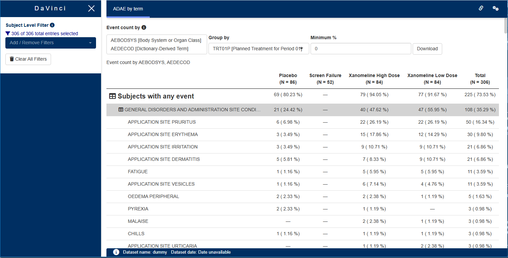

```{r, include = FALSE}
knitr::opts_chunk$set(
  collapse = TRUE,
  comment = "#>"
)
```



This guide provides a detailed overview of the `hierarchical_count_table` module and its features. It is meant to provide guidance to
App Creators on creating Apps in DaVinci using the `hierarchical_count_table` module.
Walk-throughs for sample app creation using the module are also included
to demonstrate the various module specific features.

The `hierarchical_count_table` module makes it possible to visualize a hierarchy table with event counts for each of the levels.

# Features

`hierarchical_count_table` features the following tables:

-   A hierarchy table arranged by highest to lowest event count normalized by population.

It supports bookmarking.

# Arguments for the module

`dv.tables::mod_hierarchical_count_table()`
module uses several arguments with the following being mandatory and
the rest optional. As part of app creation, the app
creator should specify the values for these arguments as applicable.

**Mandatory Arguments**

-   `module_id` : A unique identifier of type character for the module
    in the app.

-   `subjid_var`: A common column across all datasets that uniquely identify subjects. By default: "SUBJID"

-   `table_dataset_name`: The dataset that contains the events per row. For example, `ADAE`

-   `pop_dataset_name`: The dataset that contains one row per subject in the total population. For example, `ADSL`
    It expects a dataset with an structure similar to https://www.cdisc.org/kb/examples/adam-subject-level-analysis-adsl-dataset-80283806 , one record per subject
    It expects to contain, at least, `subjid_var`
    
Refer to `dv.tables::mod_hierarchical_count_table()` for the complete list of arguments and their description.

# Input menus
  
A set of menus allows to select a hierarchy, groupings and settings of the table.

# Visualizations

## Hierarchy Event Count table

A collapsable hierarchy table.

# Creating a hierarchical count table application

```{r, eval=FALSE}
requireNamespace("pharmaverseadam")

dv.manager::run_app(
  data = list(dummy = list(adsl = pharmaverseadam::adsl,
                           adae = pharmaverseadam::adae)),
  module_list = list(
    "AE Hierarchy Table" = dv.tables::mod_hierarchical_count_table(
      module_id = "hierarchical_count_table",
      table_dataset_name = "adae",
      pop_dataset_name = "adsl"
    )
  ),
  filter_data = "adsl",
  filter_key = "USUBJID"
)
```

# Download

This module allows downloading the table as Excel (.xlsx) or Word (.rtf).

In the downloaded table, overall number of patients (`N =` seen in the selected group's column header) is shown in the first row below the column names.

Additionally, if the option to split count and percent into separate columns is selected, then selected group variable's metrics is split into two columns for every group item, `{group item} [N]` to show count value and `{group item} [%]` to show relative percentage.

# Drill down functionality

When a cell is clicked the set of subjects in the cell is shown. Each of the ids is clickable and it allows
exploring that participant in additional module, for example `dv.papo`.
