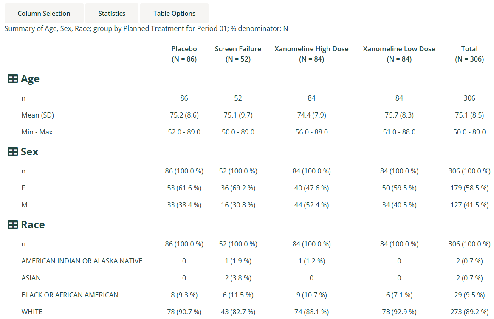
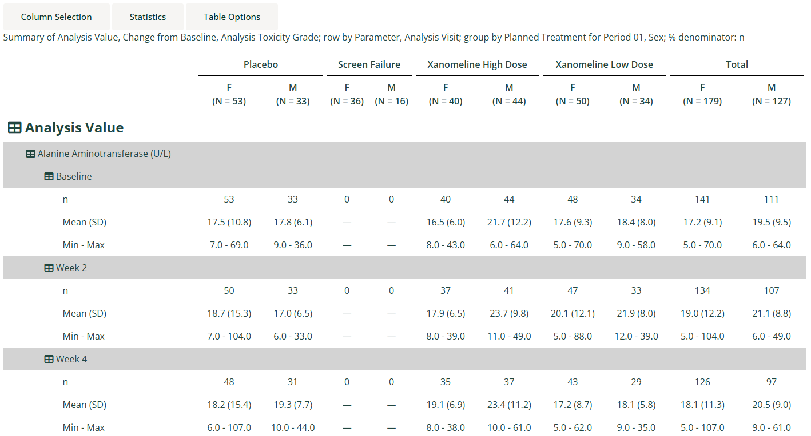
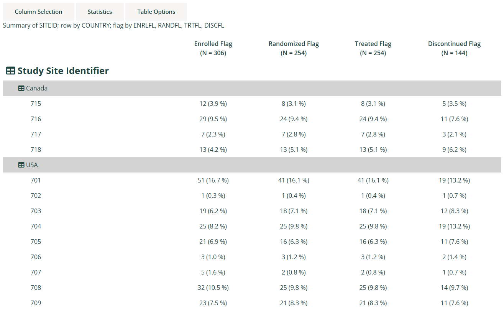

```{r, include = FALSE}
knitr::opts_chunk$set(
  collapse = TRUE,
  comment = "#>"
)
```

This guide provides a detailed overview of the `dv.tables::mod_summary_table()` module and its features. It is meant to
provide guidance to App Creators on creating Apps in DaVinci using the module. Walk-throughs for sample app creation
using the module are also included to demonstrate the various module specific features.

The module makes it possible to visualize summary statistics on one or more numerical or categorical analysis variables
grouped by variables from the population and analysis datasets.

# Features

- Summary statistics for one or more analysis variables, either count and percent for categorical data variables, or a
  selection of statistics for numerical data variables.
- Multiple levels of grouping by population dataset variables define the columns of the summary table, with group
  population size (N) displayed for each column. A special grouping level derived from one or more population flagging
  variables can also be used.
- An optional "Total" group can be derived and displayed for the first population grouping level.
- In addition to the top-level analysis variable sections, further levels of grouping by analysis dataset variables
  define the row hierarchy of the summary table.
- Optional aggregation of multiple subject results corresponding to a grouping (e.g. multiple lab results for a subject
  at a single visit) can be specified using an aggregation function.
- Analysis variable sections and row groups can be individually collapsed/hidden.
- It supports bookmarking.

# Arguments for the module

The `dv.tables::mod_summary_table()` module uses several mandatory arguments with the rest of the arguments defaulted or
optional. As part of app creation, the app creator should specify the values for all mandatory arguments, and values
for any other arguments as applicable.

**Mandatory Arguments**

- `module_id` : A unique identifier of type character for the module in the app.
- `table_dataset_name`: The name of the dataset that contains the analysis variables to be summarized, e.g., `"ADLB"`.
- `pop_dataset_name`: The name of the dataset that contains the population grouping variables. Typically this will be a
  one-record-per-subject dataset, e.g., `"ADSL"`, but may also be one-record-per-subject-per-group to accommodate
  crossover and summary population analyses.

Please refer to `dv.tables::mod_summary_table()` for the complete list of arguments and their description.

# Input menus

A drop-down "Column Selection" menu provides the following inputs:

- **Summarize on**: Selection of one or more numerical/categorical analysis variables from the analysis dataset, to be
  summarized, e.g. `AVAL`, `CHG`, `AGE`, `SEX`, `RACE`, etc.
- **Group by**: Selection of one or more grouping variables from the population dataset, to be displayed across the
  top of the table, e.g. `ARM`, `TRT01P`, `SEX`, `RACE`, etc.
- **Row by**: Selection of one or more grouping variables from the analysis dataset, to group each analysis variable,
  e.g. `PARAM`, `AVISIT`, etc.
- **Population flags**: Selection of one or more flagging variables from the population dataset, to be displayed across
  the top of the table. The flags are subsetting on `"Y"` values. This selection and the associated checkbox) are shown
  only if the app creator has specifically enabled population flags.
- **Move after grouping variables**: Checkbox that controls whether the flags should be moved to after (below) the
  grouping variables. Otherwise, they will appear before (above) the grouping variables.

A drop-down "Statistics" menu provides the following inputs:

- **Statistics**: A list of checkboxes controlling which summary statistics are displayed for the numerical analysis
  variables.

A drop-down "Table Options" menu provides the following inputs:

- **Total column**: Checkbox that controls whether or not to display a "Total" column totalling data from all group
  categories for the first population grouping level.
- **Drop NA values**: Checkbox that controls whether or not to exclude rows from population and analysis datasets when
  any "Group by" or "Row by" variable value is missing (`NA`), and exclude rows from the analysis dataset when a
  categorical analysis variable value is missing. Note that rows are always excluded from the analysis dataset when a
  numerical analysis variable value is missing.
- **Show categorical n**: Checkbox that determines whether to show the 'n' category when summarizing categorical data.
- **Denominator**: Radio buttons that determine the denominator choice for categorical data, either the number of
  subjects from the population grouping ("N") or the number of subjects from the 'row by' grouping for each population
  grouping ("n"). If the user selects to drop `NA` values then those values will be excluded from determining the "n"
  denominator.
- **Row Aggregation Method**: Radio buttons that determine the method to use for aggregating rows when more than one row
  per subject exists after population grouping and row categorization has been applied. The method is applied to the
  analysis variable. These buttons are shown only if the app creator has specifically enabled aggregation. 

# Visualizations

## Demographic Summary table

A collapsible demographic analysis summary table. The subject-level population dataset name is passed to both the
`table_dataset_name` and `pop_dataset_name` arguments.

{style="border: 2px solid gray;"}

## Laboratory Summary table

A collapsible laboratory analysis summary table with rows grouped by parameter and visit. The subject-level population
dataset name is passed to the `pop_dataset_name` argument and the laboratory results dataset name is passed to the
`table_dataset_name` argument.

{style="border: 2px solid gray;"}

## Population Summary table

A collapsible population summary table with populations displayed across the top of the table. The subject-level
population dataset name is passed to both the `table_dataset_name` and `pop_dataset_name` arguments.

{style="border: 2px solid gray;"}

# Creating a summary table application

## Example 1

The following code specifies the bare minimum module arguments with no default analysis, group or row variables
specified:

```{r, eval=FALSE}
dv.manager::run_app(
  data = list(pharmaverseadam = list(adsl = pharmaverseadam::adsl)),
  module_list = list(
    "ADSL Summary Table" = dv.tables::mod_summary_table(
      module_id = "summary_table",
      table_dataset_name = "adsl",
      pop_dataset_name = "adsl"
    )
  ),
  filter_data = "adsl",
  filter_key = "USUBJID"
)
```

## Example 2

The following code specifies module arguments for the summary of age statistics and sex and race categories by planned
treatment group:

```{r, eval=FALSE}
dv.manager::run_app(
  data = list(pharmaverseadam = list(adsl = pharmaverseadam::adsl)),
  module_list = list(
    "ADSL Summary Table" = dv.tables::mod_summary_table(
      module_id = "summary_table",
      table_dataset_name = "adsl",
      pop_dataset_name = "adsl",
      default_summarize_on = c("AGE", "SEX", "RACE"),
      default_group_by = c("TRT01P"),
      default_stats = c("n", "meansd", "meanci", "minmax")
    )
  ),
  filter_data = "adsl",
  filter_key = "USUBJID"
)
```

## Example 3

The following code specifies module arguments for the summary of laboratory analysis values and change from baseline
statistics, and toxicity grade categories by planned treatment group and sex, with rows grouped by parameter and visit:

```{r, eval=FALSE}
adsl <- pharmaverseadam::adsl
adlb <- pharmaverseadam::adlb |>
  dplyr::filter(.data[["LBTESTCD"]] %in% c("ALP", "ALT", "AST", "BILI"),
                .data[["AVISITN"]] %in% c(0, 4, 5, 7))

dv.manager::run_app(
  data = list(pharmaverseadam = list(adsl = adsl, adlb = adlb)),
  module_list = list(
    "ADLB Summary Table" = dv.tables::mod_summary_table(
      module_id = "summary_table",
      table_dataset_name = "adlb",
      pop_dataset_name = "adsl",
      show_aggregate_method = TRUE,
      default_summarize_on = c("AVAL", "CHG", "ATOXGR"),
      default_group_by = c("TRT01P", "SEX"),
      default_row_by = c("PARAM", "VISIT"),
      default_denom = "n",
      default_aggregate_method = "max"
    )
  ),
  filter_data = "adsl",
  filter_key = "USUBJID"
)
```

The `max` function has been specified here for the aggregation method, so if a subject has more than one lab result for
a specific parameter and visit, then the maximum value will be taken before it gets processed in the main statistical
analysis. The app creator needs to decide on the most appropriate aggregation function, but it is not possible to
handle cases where the appropriate aggregation method varies between parameters - in this case the data would need to be
pre-processed before being passed to the app.

Note: Summarizing large datasets with more than one grouping can take a long time to process so pre-subsetting on the
values of interest is recommended. If subsetting was not applied to the above example, then it would take around 15
minutes to process.

## Example 4

The following code specifies example pre-processing and module arguments for a population summary table with populations
displayed across the top of the table, and linking to patient profiles enabled:

```{r, eval=FALSE}
adsl <- pharmaverseadam::adsl

adsl <- pharmaverseadam::adsl |>
  dplyr::mutate(ENRLFL = "Y",
                TRTFL = ifelse(is.na(TRTSDT), "N", "Y"),
                RANDFL = ifelse(is.na(RANDDT), "N", "Y"),
                DISCFL = ifelse(EOSSTT == "DISCONTINUED", "Y", "N"))

attr(adsl[["ENRLFL"]], "label") <- "Enrolled Flag"
attr(adsl[["RANDFL"]], "label") <- "Randomized Flag"
attr(adsl[["TRTFL"]], "label") <- "Treated Flag"
attr(adsl[["DISCFL"]], "label") <- "Discontinued Flag"

dv.manager::run_app(
  data = list(pharmaverseadam = list(adsl = adsl)),
  module_list = list(
    "Population Summary" = mod_summary_table(
      module_id = "pop_summtab",
      show_pop_flag_selection = TRUE,
      table_dataset_name = "adsl",
      pop_dataset_name = "adsl",
      default_summarize_on = c("SITEID"),
      default_group_by = NULL,
      default_row_by = c("COUNTRY"),
      default_total = FALSE,
      default_drop_na = TRUE,
      default_drop_empty_rows = TRUE,
      default_show_category_n = FALSE,
      default_pop_flags = c("ENRLFL", "RANDFL", "TRTFL", "DISCFL"),
      default_pop_flags_after_groups = FALSE,
      receiver_id = "papo"
    ),
    "Patient Profile" = dv.papo::mod_patient_profile(
      module_id = "papo",
      subject_level_dataset_name = "adsl",
      subjid_var = "USUBJID",
      sender_ids = c("pop_summtab"),
      summary = list(vars = c("AGE", "SEX", "RACE", "ETHNIC", "ARM"),
                     column_count = 1)
    )
  ),
  filter_data = "adsl",
  filter_key = "USUBJID"
)
```

## User-defined statistics for numerical analysis

A named list of statistical functions is passed to the `stats_functions` argument. The default is as follows:

```
stats_functions = list(
  n = length,
  mean = mean,
  sd = stats::sd,
  meanci = \(x) if (length(x) > 1L) stats::t.test(x, conf.level = 0.95)$conf.int else rep(NA_real_, 2L),
  geomean = \(x) if (all(x > 0)) exp(mean(log(x))) else NaN,
  median = stats::median,
  medianci = \(x) if (length(x) > 1L) stats::wilcox.test(x, exact = FALSE, conf.int = TRUE, conf.level = 0.95)$conf.int else rep(NA_real_, 2L),
  q1q3 = \(x) stats::quantile(x, c(0.25, 0.75)),
  min = min,
  max = max
)
```

The functions must either return a single numeric value (e.g. `mean`, `stats::sd`, etc.) or a vector of numeric values
(e.g. `\(x) stats::quantile(x, c(0.25, 0.75))`). Note that the functions will not be applied to empty groupings, but if
a function requires more than one data point (e.g. `stats::t.test`) then the error cases must be dealt with using a
wrapper function:

```
meanci = function(x) {
  if (length(x) > 1L) { # At least 2 values needed for t.test
    stats::t.test(x, conf.level = 0.95)$conf.int
  } else { # Return tuple of NA values
    rep(NA_real_, 2L)
  }
}
```

When such functions return multiple values, those values can be referred to in `stats_formats`, `stats_labels`, and
`stats_replace` by appending a dot followed by an incremented integer. So for the example of `meanci` which returns
two values, those values can be referred to as `meanci.1` and `meanci.2` respectively.

## User-defined combination and formatting of statistics for numerical analysis

A named list of formats can be passed to the `stats_formats` argument. The default is as follows:

```
stats_formats = list(
  n = list(fmt = "%d", "n"),
  meansd = list(fmt = "%.1f (%.1f)", "mean", "sd"),
  meanci = list(fmt = "(%.2f, %.2f)", "meanci.1", "meanci.2"),
  geomean = list(fmt = "%.1f", "geomean"),
  median = list(fmt = "%.1f", "median"),
  medianci = list(fmt = "(%.2f, %.2f)", "medianci.1", "medianci.2"),
  q1q3 = list(fmt = "%.1f - %.1f", "q1q3.1", "q1q3.2"),
  minmax = list(fmt = "%.1f - %.1f", "min", "max")
)
```

Each format is a list of arguments passed to `sprintf(fmt, ...)`, typically the `fmt` argument first, followed by all
the insertion values.

Values from single return value statistical functions defined in `stats_functions` are referred to by the name of the
`stats_functions` list element (like `"n"`, `"mean"` and `"sd"` in the default). Values from multi-value return
statistical functions must be referred to using their integer suffix (like `"meanci.1"` and `"meanci.2"` in the
default).

The formatted result is assigned to the element name (internally corresponding to an interim results data frame column
name). Any results from functions given in `stats_functions` that do not appear in the formatting will be automatically
formatted as character.

## User-defined labelling of statistics for numerical analysis

A named vector of statistics labels can be passed to the `stats_labels` argument. The default is as follows:

```
stats_labels = c(
  n = "n",
  meansd = "Mean (SD)",
  meanci = "Mean 95% CI",
  geomean = "Geometric Mean",
  median = "Median",
  medianci = "Median 95% CI",
  q1q3 = "25% and 75%-ile",
  minmax = "Min - Max"
)
```
    
The names correspond either to the names assigned in the `stats_formats` list, or otherwise the names in the
`stats_functions` list.

Labels apply to UI statistics checkbox labels and table statistics labels. Note that if a function defined in
`stats_functions` returns more than one value, e.g. `stats::quantile`, and those values are not combined in
`stats_formats`, then they appear separately in the table statistics, but the UI statistics checkbox will reflect the
name given to the function definition. Labels can be applied to both cases, for example:

```
stats_functions = list(
  ...
  meanci = \(x) if (length(x) > 1L) stats::t.test(x, conf.level = 0.95)$conf.int else rep(NA_real_, 2L),
  ...  
),
stats_formats = list(
  ...
  meanci.1 = list(fmt = "%.2f", "meanci.1"),
  meanci.2 = list(fmt = "%.2f", "meanci.2"),
  ...
),
stats_labels = c(
  ...
  meanci = "Mean 95% CI",            # Appears as text in UI checkbox
  meanci.1 = "Mean 95% CI (lower)",  # Appears as table statistic text
  meanci.2 = "Mean 95% CI (upper)",  # Appears as table statistic text
  ...
)
```

## User-defined formatted value replacements for numerical analysis

A named list of formatted value replacements can be passed to the `stats_replace` argument. Primarily this is used for
presentation formatting, such as replacing values like `NA` and `NaN` with zeros, dashes or `NE`. The default is as
follows:

```
stats_replace = list(
  n = c(`^NA$` = "0"),
  meansd = c(`^NA \\(NA\\)$` = SUMMTAB$VAL$EM_DASH,
             `\\(NA\\)$` = sprintf("(%s)", SUMMTAB$VAL$EM_DASH)),
  meanci = c(`^\\(NA, NA\\)$` = SUMMTAB$VAL$EM_DASH),
  geomean = c(`^NA$` = SUMMTAB$VAL$EM_DASH,
              `^NaN$` = "NE"),
  median = c(`^NA$` = SUMMTAB$VAL$EM_DASH),
  medianci = c(`^\\(NA, NA\\)$` = SUMMTAB$VAL$EM_DASH),
  q1q3 = c(`^NA - NA$` = SUMMTAB$VAL$EM_DASH),
  minmax = c(`^NA - NA$` = SUMMTAB$VAL$EM_DASH)
)
```

The name of each element of the list directly corresponds to a name from the `stats_formats` list.

Each of those elements is a named vector defining regular expression substitutions to be applied for that formatted
statistic. The names given to the vector elements are regular expressions to match the formatted results, and the
elements themselves are the replacement strings.

In the default, the em dash (long dash) has been specified by the package constant `SUMMTAB$VAL$EM_DASH`, but the
unicode value, `"\u2014"`, can also be directly used.


# Download

This module currently does not allow downloading the table as Excel (.xlsx) or Word (.rtf).

# Drill down functionality

When a cell is clicked the set of subjects in the cell is shown. Each of the ids is clickable and it allows
exploring that participant in an additional module, for example `dv.papo`.
