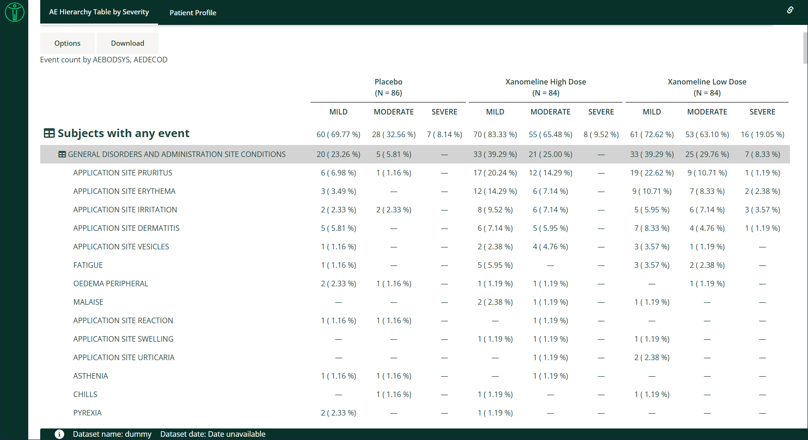

```{r, include = FALSE}
knitr::opts_chunk$set(
  collapse = TRUE,
  comment = "#>"
)
```




This guide provides a detailed overview of the `dv.tables::mod_summary_table()` module and its features. It is meant to
provide guidance to App Creators on creating Apps in DaVinci using the module. Walk-throughs for sample app creation
using the module are also included to demonstrate the various module specific features.

The module makes it possible to visualize summary statistics on one or more numerical or categorical analysis variables
grouped by variables from the population and analysis datasets.

# Features

- Summary statistics for one or more analysis variables, either count and percent for categorical data variables, or a
  selection of statistics for numerical data variables.
- Multiple levels of grouping by population dataset variables define the columns of the summary table, with group
  population size (N) displayed for each column.
- An optional "Total" group can be derived and displayed for the first population grouping level.
- In addition to the top-level analysis variable sections, further levels of grouping by analysis dataset variables
  define the row hierarchy of the summary table.
- Analysis variable sections and row groups can be individually collapsed/hidden.
- It supports bookmarking.

# Arguments for the module

The `dv.tables::mod_summary_table()` module uses several mandatory arguments with the rest of the arguments defaulted or
optional. As part of app creation, the app creator should specify the values for all mandatory arguments, and values
for any other arguments as applicable.

**Mandatory Arguments**

- `module_id` : A unique identifier of type character for the module in the app.
- `table_dataset_name`: The name of the dataset that contains the analysis variables to be summarized, e.g., `"ADLB"`.
- `pop_dataset_name`: The name of the dataset that contains the population grouping variables. Typically this will be a
  one-record-per-subject dataset, e.g., `"ADSL"`, but may also be one-record-per-subject-per-group to accommodate
  crossover and summary population analyses.

Please refer to [`dv.tables::mod_summary_table()`](../reference/mod_summary_table.html) for the complete list of
arguments and their description.

# Input menus

A drop-down "Column Selection" menu provides the following inputs:

- **Summarize on**: Selection of one or more numerical/categorical analysis variables from the analysis dataset, to be
  summarized, e.g. `AVAL`, `CHG`, `AGE`, `SEX`, `RACE`, etc.
- **Group by**: Selection of one or more grouping variables from the population dataset, to be displayed across the
  top of the table, e.g. `ARM`, `TRT01P`, `SEX`, `RACE`, etc.
- **Row by**: Selection of one or more grouping variables from the analysis dataset, to group each analysis variable,
  e.g. `PARAM`, `AVISIT`, etc.

A drop-down "Statistics" menu provides the following inputs:

- **Statistics**: A list of checkboxes controlling which summary statistics are displayed for the numerical analysis
  variables.

A drop-down "Table Options" menu provides the following inputs:

- **Total column**: Checkbox that controls whether or not to display a "Total" column totalling data from all group
  categories for the first population grouping level.
- **Drop NA values**: Checkbox that controls whether or not to exclude rows from population and analysis datasets when
  any "Group by" or "Row by" variable value is missing (`NA`), and exclude rows from the analysis dataset when a
  categorical analysis variable value is missing. Note that rows are always excluded from the analysis dataset when a
  numerical analysis variable value is missing.
- **Show categorical n**: TBD
- **Denominator**: TBD
- **Row Collapse Method**: TBD

# Visualizations

## Hierarchy Event Count table

A collapsible hierarchy table that can optionally display time at risk and incidence rate.

# Creating a hierarchical count table application

The following code specifies the bare minimum module arguments with no default hierarchy or group specified:

```{r, eval=FALSE}
requireNamespace("pharmaverseadam")

dv.manager::run_app(
  data = list(dummy = list(adsl = pharmaverseadam::adsl,
                           adae = pharmaverseadam::adae)),
  module_list = list(
    "AE Hierarchy Table" = dv.tables::mod_summary_table(
      module_id = "hierarchical_count_table",
      table_dataset_name = "adae",
      pop_dataset_name = "adsl"
    )
  ),
  filter_data = "adsl",
  filter_key = "USUBJID"
)
```

The following code specifies module arguments for the display of a body system and preferred term hierarchy grouped
by planned treatment group, and event severity:

```{r, eval=FALSE}
requireNamespace("pharmaverseadam")

dv.manager::run_app(
  data = list(dummy = list(adsl = pharmaverseadam::adsl,
                           adae = pharmaverseadam::adae)),
  module_list = list(
    "AE Hierarchy Table by Severity" = dv.tables::mod_summary_table(
      module_id = "summary_table",
      table_dataset_name = "adae",
      pop_dataset_name = "adsl",
      show_event_group_by = TRUE,
      default_hierarchy = c("AEBODSYS", "AEDECOD"),
      default_group = "TRT01P",
      default_event_group = "AESEV",
      default_total = FALSE,
      event_group_choices = c("AESEV", "AETOXGR")
    )
  ),
  filter_data = "adsl",
  filter_key = "USUBJID"
)
```

The following code specifies module arguments for the display of a body system and preferred term hierarchy and planned
treatment group, with date variables specified for time at risk and incidence rate analysis:

```{r, eval=FALSE}
requireNamespace("pharmaverseadam")

dv.manager::run_app(
  data = list(dummy = list(adsl = pharmaverseadam::adsl,
                           adae = pharmaverseadam::adae)),
  module_list = list(
    "Summary Table" = dv.tables::mod_summary_table(
      module_id = "summary_table",
      table_dataset_name = "adae",
      pop_dataset_name = "adsl",
      show_time_at_risk_options = TRUE,
      default_hierarchy = c("AEBODSYS", "AEDECOD"),
      default_group = "TRT01P",
      default_event_date = "ASTDT",
      default_origin_date = "TRTSDT",
      default_censor_date = "EOSDT",
      default_total = FALSE,
      default_risk = TRUE
    )
  ),
  filter_data = "adsl",
  filter_key = "USUBJID"
)
```

# Download

This module currently does not allow downloading the table as Excel (.xlsx) or Word (.rtf).

# Drill down functionality

When a cell is clicked the set of subjects in the cell is shown. Each of the ids is clickable and it allows
exploring that participant in an additional module, for example `dv.papo`.
